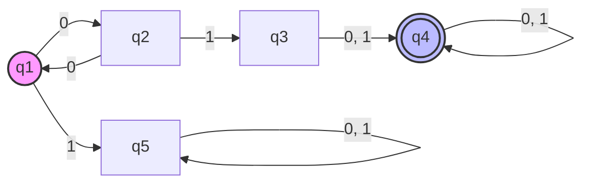

```mermaid
graph LR
    q1((q1))
    q4(((q4)))
    
    q1 -->|0| q2
    q1 -->|1| q5
    q2 -->|0| q1
    q2 -->|1| q3
    
    q3 -->|0, 1| q4
    
    q4 -->|0, 1| q4
    q5 -->|0, 1| q5

    style q1 fill:#f9f,stroke:#333,stroke-width:2px
    style q4 fill:#bbf,stroke:#333,stroke-width:2px
```