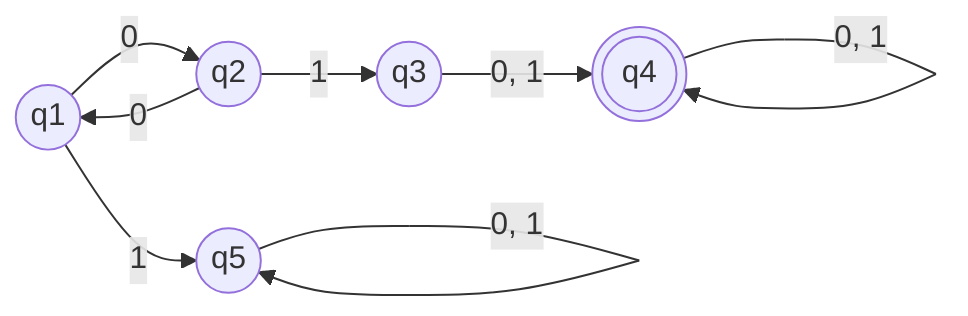

### Implementation & Input Processing

---
The logic in `DFA.py` mirrors the structure of the input file (`DFA.in`) and simulates the automaton using the following approach:

* **Data Parsing:** 

The file structure is dynamically parsed into local variables. The transition table $\delta$ is efficiently modeled as a nested dictionary (`delta[current_state][input_symbol] = next_state`).

* **Simulation & Validation:** 

The `verif(word)` function processes each word character by character, tracking the active path. A word is accepted (`DA`) if the simulation halts successfully in a final state $F \in \text{set}(F)$, otherwise it is rejected (`NU`).

* **Bonus Tracking:** 

The execution path is saved dynamically during evaluation and printed to the console for accepted words.
  * **Transitions Path**:

The alphabet ($\Sigma$) is dynamically reconstructed from the transition table keys at runtime using a dictionary comprehension.
  
---

### Visual Representation of `DFA.in`, after processing

---
