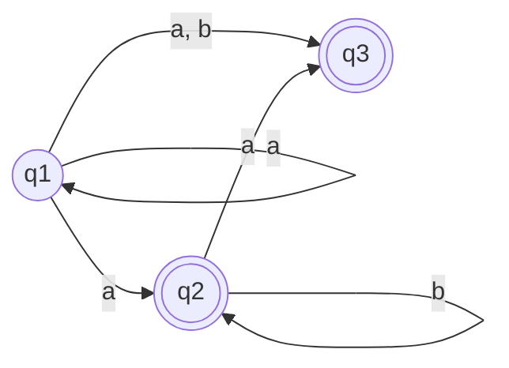
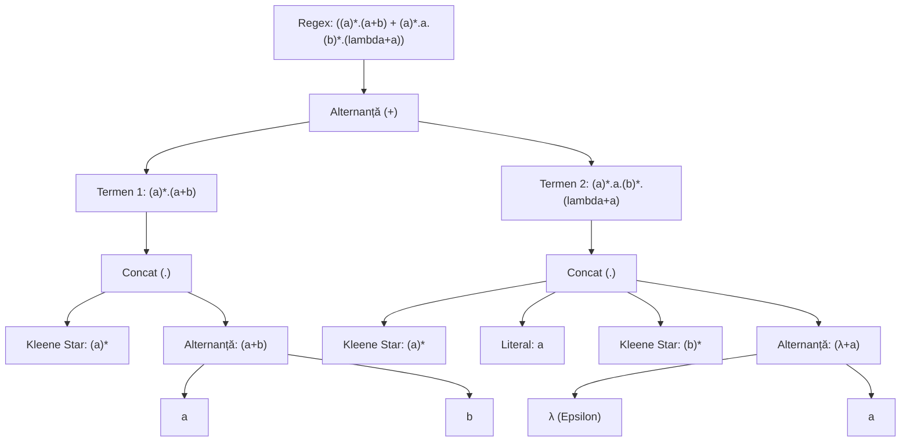

## Visual Representation of `RegEx.in`, before processing

```mermaid
graph LR
    %% Definition of states
    q1((q1))
    q2(((q2)))
    q3(((q3)))
    
    %% Transitions
    q1 -->|a| q1
    q1 -->|a| q2
    q1 -->|a, b| q3
    q2 -->|a| q3
    q2 -->|b| q2
```

## Visual Representation of `RegEx.out`, after processing

```mermaid
graph TD
    %% Nodul Principal (Rădăcina)
    Regex["Regex: ((a)*.(a+b) + (a)*.a.(b)*.(lambda+a))"] --> Alt["Alternanță (+)"]

    %% Termenul 1
    Alt --> T1["Termen 1: (a)*.(a+b)"]
    T1 --> Cat1["Concat (.)"]
    Cat1 --> K1["Kleene Star: (a)*"]
    Cat1 --> A1["Alternanță: (a+b)"]
    A1 --> a1[a]
    A1 --> b1[b]

    %% Termenul 2
    Alt --> T2["Termen 2: (a)*.a.(b)*.(lambda+a)"]
    T2 --> Cat2["Concat (.)"]
    
    Cat2 --> K2["Kleene Star: (a)*"]
    Cat2 --> a2["Literal: a"]
    Cat2 --> K3["Kleene Star: (b)*"]
    Cat2 --> A2["Alternanță: (&lambda;+a)"]
    
    A2 --> l1["&lambda; (Epsilon)"]
    A2 --> a3[a]

```