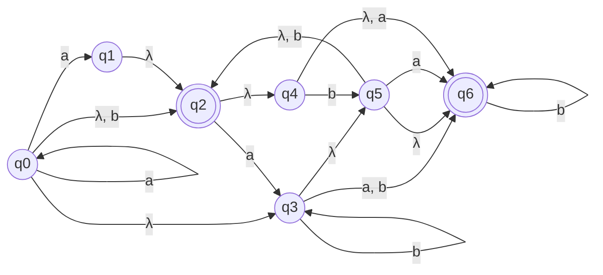
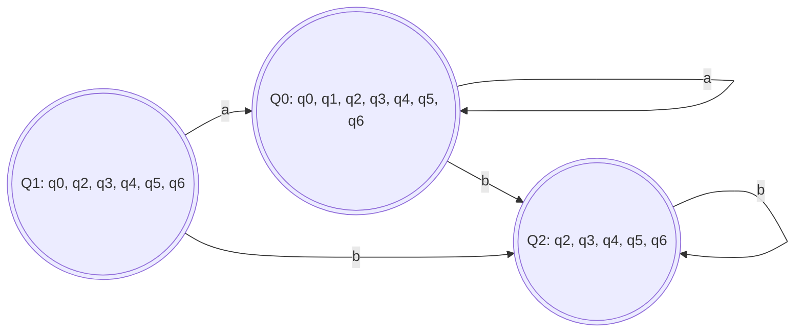
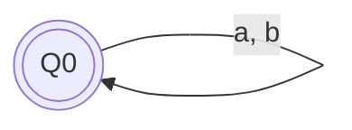

## Visual Representation of `minimization.in`, before processing

## Visual Representation of `minimization.out`, after first processing

## Visual Representation of `minimization.out`, after second processing
